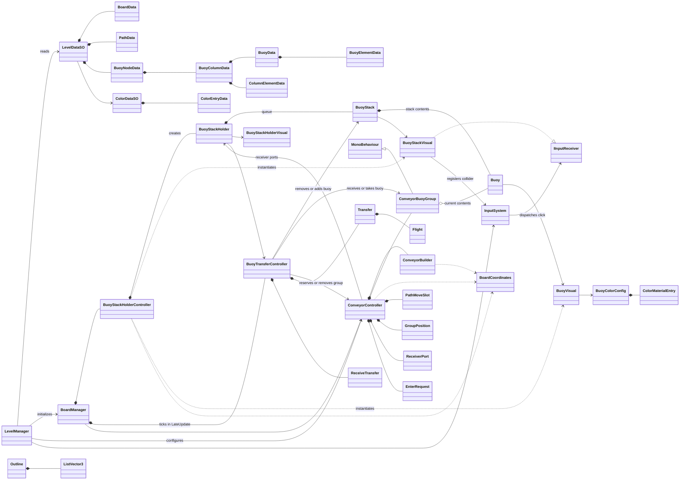
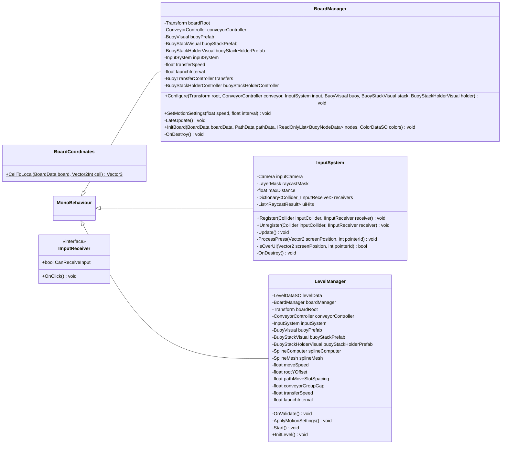
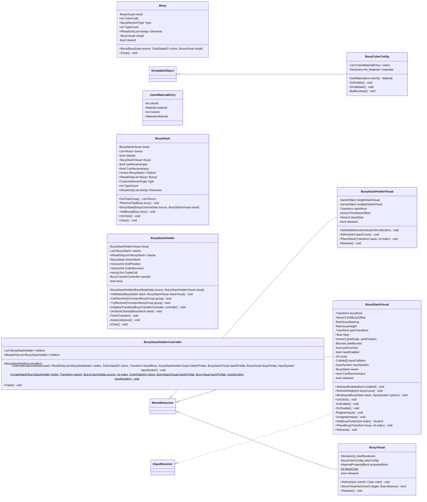
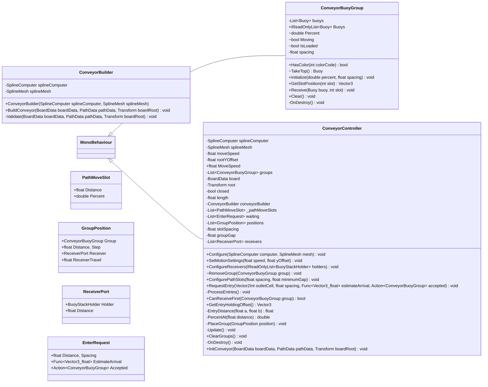
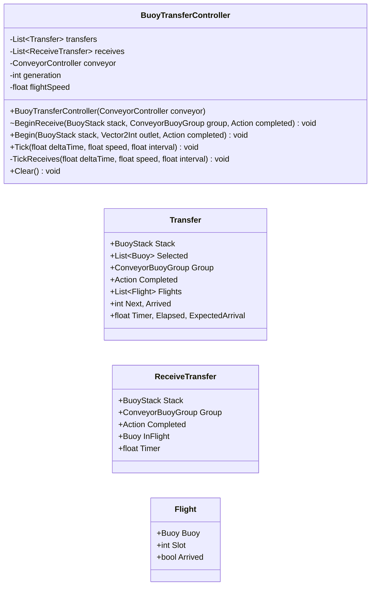
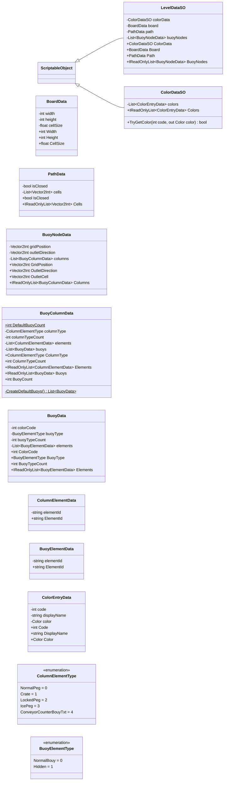
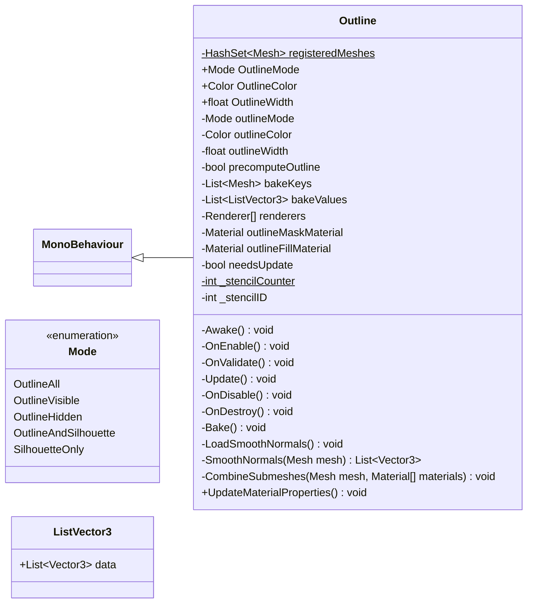

# Class diagram - current implementation

Source snapshot: 2026-09-17. Scope: all Assets/Scripts/GameCore types, related level data, palette and enum types, and QuickOutline. Unity/Dreamteck internals and editor tooling are external. This documents existing code; fixed holder visuals, queue tweening and transfers from a moving group are not implemented yet.

## Legend

`+` public, `-` private (including implicit private), `~` internal, `#` protected, `$` static/const. Fields and properties have no parentheses; C# declarations below retain attributes and property accessors. `*--` lifecycle ownership, `o--` transferable contents, `-->` reference, `..>` dependency, `<|--` inheritance, `<|..` interface implementation. Mermaid generics use `~Type~`; multi-argument generics use `_`. The C# listings are declaration summaries, not compilable class bodies.

## Overview relationships



## Level, board and input



### C# declarations and attributes

#### BoardCoordinates

Source: [Assets/Scripts/GameCore/BoardSystem/BoardCoordinates.cs](../Assets/Scripts/GameCore/BoardSystem/BoardCoordinates.cs).

```csharp
public static Vector3 CellToLocal(BoardData board, Vector2Int cell)
```

#### BoardManager

Source: [Assets/Scripts/GameCore/BoardSystem/BoardManager.cs](../Assets/Scripts/GameCore/BoardSystem/BoardManager.cs).

```csharp
[Tooltip("Board center and orientation. Keep its world scale at one for CellSize in world units.")]
private Transform boardRoot
private ConveyorController conveyorController
private BuoyVisual buoyPrefab
private BuoyStackVisual buoyStackPrefab
private BuoyStackHolderVisual buoyStackHolderPrefab
private InputSystem inputSystem
private float transferSpeed = 4f
private float launchInterval = 0.12f
public void Configure(Transform root, ConveyorController conveyor, InputSystem input, BuoyVisual buoy, BuoyStackVisual stack, BuoyStackHolderVisual holder)
public void SetMotionSettings(float speed, float interval)
private BuoyTransferController transfers
private void LateUpdate()
private readonly BuoyStackHolderController buoyStackHolderController = new BuoyStackHolderController()
public void InitBoard(BoardData boardData, PathData pathData, IReadOnlyList<BuoyNodeData> nodes, ColorDataSO colors)
private void OnDestroy()
```

#### IInputReceiver

Source: [Assets/Scripts/GameCore/InputSystem/IInputReceiver.cs](../Assets/Scripts/GameCore/InputSystem/IInputReceiver.cs).

```csharp
bool CanReceiveInput { get; }
void OnClick()
```

#### InputSystem

Source: [Assets/Scripts/GameCore/InputSystem/InputSystem.cs](../Assets/Scripts/GameCore/InputSystem/InputSystem.cs).

```csharp
[SerializeField]
private Camera inputCamera
[SerializeField]
private LayerMask raycastMask = Physics.DefaultRaycastLayers
[SerializeField, Min(0.01f)]
private float maxDistance = 1000f
private readonly Dictionary<Collider, IInputReceiver> receivers = new Dictionary<Collider, IInputReceiver>()
private readonly List<RaycastResult> uiHits = new List<RaycastResult>()
public void Register(Collider inputCollider, IInputReceiver receiver)
public void Unregister(Collider inputCollider, IInputReceiver receiver)
private void Update()
private void ProcessPress(Vector2 screenPosition, int pointerId)
private bool IsOverUI(Vector2 screenPosition, int pointerId)
private void OnDestroy()
```

#### LevelManager

Source: [Assets/Scripts/GameCore/LevelSystem/LevelManager.cs](../Assets/Scripts/GameCore/LevelSystem/LevelManager.cs).

```csharp
[SerializeField]
private LevelDataSO levelData
[SerializeField]
private BoardManager boardManager
[Header("Board Setup")] [SerializeField]
private Transform boardRoot
[SerializeField]
private ConveyorController conveyorController
[SerializeField]
private InputSystem inputSystem
[SerializeField]
private BuoyVisual buoyPrefab
[SerializeField]
private BuoyStackVisual buoyStackPrefab
[SerializeField]
private BuoyStackHolderVisual buoyStackHolderPrefab
[Header("Conveyor Setup")] [SerializeField]
private SplineComputer splineComputer
[SerializeField]
private SplineMesh splineMesh
[SerializeField, Min(0f)]
private float moveSpeed = 1f
[Tooltip("Group root height above the spline, along the board's local up axis, in world units.")] [SerializeField]
private float rootYOffset = 0.2f
[SerializeField, Min(0.01f)]
private float pathMoveSlotSpacing = 0.3f
[SerializeField, Min(0.01f)]
private float conveyorGroupGap = 0.6f
[Header("Transfer Setup")] [SerializeField, Min(0.01f)]
private float transferSpeed = 4f
[SerializeField, Min(0f)]
private float launchInterval = 0.12f
private void OnValidate()
private void ApplyMotionSettings()
private void Start()
public void InitLevel()
```

## Buoys, stacks and holders



### C# declarations and attributes

#### Buoy

Source: [Assets/Scripts/GameCore/BoardSystem/Buoys/Buoy.cs](../Assets/Scripts/GameCore/BoardSystem/Buoys/Buoy.cs).

```csharp
private readonly BuoyVisual visual
public int ColorCode { get; }
public BuoyElementType Type { get; }
public int TypeCount { get; }
public IReadOnlyList<string> Elements { get; }
internal BuoyVisual Visual => visual;
private bool cleared
public Buoy(BuoyData source, ColorDataSO colors, BuoyVisual visual)
public void Clear()
```

#### BuoyColorConfig

Source: [Assets/Scripts/GameCore/BoardSystem/Buoys/BuoyColorConfig.cs](../Assets/Scripts/GameCore/BoardSystem/Buoys/BuoyColorConfig.cs).

```csharp
[SerializeField]
private List<ColorMaterialEntry> colors = new List<ColorMaterialEntry>()
private Dictionary<int, Material> materials
public Material GetMaterial(int colorId)
private void OnEnable()
private void OnValidate()
private void BuildLookup()
```

#### ColorMaterialEntry

Source: [Assets/Scripts/GameCore/BoardSystem/Buoys/BuoyColorConfig.cs](../Assets/Scripts/GameCore/BoardSystem/Buoys/BuoyColorConfig.cs).

```csharp
[SerializeField]
private int colorId
[SerializeField]
private Material material
public int ColorId => colorId;
public Material Material => material;
```

#### BuoyStack

Source: [Assets/Scripts/GameCore/BoardSystem/Buoys/BuoyStack.cs](../Assets/Scripts/GameCore/BoardSystem/Buoys/BuoyStack.cs).

```csharp
private readonly BuoyStackVisual visual
private readonly List<Buoy> buoys = new List<Buoy>()
private bool cleared
internal BuoyStackVisual Visual => visual;
private bool canReceiveInput
public bool CanReceiveInput
public List<Buoy> GetTopGroup()
internal void RemoveTop(Buoy buoy)
public event Action<BuoyStack> Clicked
public IReadOnlyList<Buoy> Buoys { get; }
public ColumnElementType Type { get; }
public int TypeCount { get; }
public IReadOnlyList<string> Elements { get; }
public BuoyStack(BuoyColumnData source, BuoyStackVisual visual)
internal void AddBuoy(Buoy buoy)
public void OnClick()
public void Clear()
```

#### BuoyStackHolder

Source: [Assets/Scripts/GameCore/BoardSystem/Buoys/BuoyStackHolder.cs](../Assets/Scripts/GameCore/BoardSystem/Buoys/BuoyStackHolder.cs).

```csharp
private readonly BuoyStackHolderVisual visual
private readonly List<BuoyStack> stacks = new List<BuoyStack>()
public IReadOnlyList<BuoyStack> Stacks { get; }
public BuoyStack ActiveStack => stacks.Count > 0 ? stacks[0] : null;
public Vector2Int GridPosition { get; }
public Vector2Int OutletDirection { get; }
public Vector2Int OutletCell => GridPosition + OutletDirection;
public BuoyStackHolder(BuoyNodeData source, BuoyStackHolderVisual visual)
internal void AddStack(BuoyStack stack, BuoyStackVisual stackVisual)
private BuoyTransferController transfer
private bool busy
internal bool CanReceive(ConveyorBuoyGroup group)
internal bool TryReceive(ConveyorBuoyGroup group)
public void InitializeTransfers(BuoyTransferController controller)
private void OnStackClicked(BuoyStack stack)
private void FinishTransfer()
private void AdvanceQueue()
public void Clear()
```

#### BuoyStackHolderController

Source: [Assets/Scripts/GameCore/BoardSystem/Buoys/BuoyStackHolderController.cs](../Assets/Scripts/GameCore/BoardSystem/Buoys/BuoyStackHolderController.cs).

```csharp
private readonly List<BuoyStackHolder> holders = new List<BuoyStackHolder>()
public IReadOnlyList<BuoyStackHolder> Holders { get; }
public BuoyStackHolderController()
public void InitHolders(BoardData board, IReadOnlyList<BuoyNodeData> nodes, ColorDataSO colors, Transform boardRoot, BuoyStackHolderVisual holderPrefab, BuoyStackVisual stackPrefab, BuoyVisual buoyPrefab, InputSystem inputSystem)
private static void CreateStack(BuoyStackHolder holder, Transform parent, BuoyColumnData source, int index, ColorDataSO colors, BuoyStackVisual stackPrefab, BuoyVisual buoyPrefab, InputSystem inputSystem)
public void Clear()
```

#### BuoyStackHolderVisual

Source: [Assets/Scripts/GameCore/BoardSystem/Buoys/BuoyStackHolderVisual.cs](../Assets/Scripts/GameCore/BoardSystem/Buoys/BuoyStackHolderVisual.cs).

```csharp
[Tooltip("Optional decorative objects, separate from the stack root.")] [SerializeField]
private GameObject singleStackVisual
[SerializeField]
private GameObject multipleStackVisual
[SerializeField]
private Transform stackRoot
[SerializeField]
private Vector3 firstStackOffset
[SerializeField]
private Vector3 stackStep = new Vector3(0f, 0f, -0.8f)
public void SetOutletDirection(Vector2Int direction)
public void Refresh(int stackCount)
public void PlaceStack(Transform stack, int index)
private bool released
public void Release()
```

#### BuoyStackVisual

Source: [Assets/Scripts/GameCore/BoardSystem/Buoys/BuoyStackVisual.cs](../Assets/Scripts/GameCore/BoardSystem/Buoys/BuoyStackVisual.cs).

```csharp
[SerializeField]
private Transform buoyRoot
[SerializeField]
private Vector3 firstBuoyOffset = new Vector3(0f, 0.2f, 0f)
[SerializeField, Min(0f)]
private float buoySpacing = 0f
[SerializeField, Min(0.01f)]
private float buoyHeight = 0.2f
[SerializeField]
private Transform poleTransform
public float Step => buoyHeight + buoySpacing;
private Vector3 poleScale, polePosition
private Bounds poleBounds
private bool poleCached
private bool inputEnabled
private int count
public void SetInputEnabled(bool enabled)
public void RefreshHeight(int buoyCount)
[SerializeField]
private Collider[] inputColliders
private InputSystem inputSystem
private BuoyStack owner
public bool CanReceiveInput => !released && isActiveAndEnabled && owner != null && owner.CanReceiveInput;
public void BindInput(BuoyStack stack, InputSystem system)
public void OnClick()
private void OnEnable()
private void OnDisable()
private void RegisterInput()
private void UnregisterInput()
public Vector3 GetBuoyPosition(int index)
public void PlaceBuoy(Transform buoy, int index)
private bool released
public void Release()
```

#### BuoyVisual

Source: [Assets/Scripts/GameCore/BoardSystem/Buoys/BuoyVisual.cs](../Assets/Scripts/GameCore/BoardSystem/Buoys/BuoyVisual.cs).

```csharp
[Tooltip("Only renderers which should receive the buoy color.")] [SerializeField]
private Renderer[] colorRenderers
[SerializeField]
private BuoyColorConfig colorConfig
private MaterialPropertyBlock propertyBlock
private static readonly int BaseColor = Shader.PropertyToID("_Color")
public void Refresh(int colorId, Color color)
public bool MoveTowards(Vector3 target, float distance)
private bool released
public void Release()
```

## Conveyor



### C# declarations and attributes

#### ConveyorBuilder

Source: [Assets/Scripts/GameCore/BoardSystem/Conveyor/ConveyorBuilder.cs](../Assets/Scripts/GameCore/BoardSystem/Conveyor/ConveyorBuilder.cs).

```csharp
private readonly SplineComputer splineComputer
private readonly SplineMesh splineMesh
public ConveyorBuilder(SplineComputer splineComputer, SplineMesh splineMesh)
public void BuildConveyor(BoardData boardData, PathData pathData, Transform boardRoot)
private void Validate(BoardData boardData, PathData pathData, Transform boardRoot)
```

#### ConveyorBuoyGroup

Source: [Assets/Scripts/GameCore/BoardSystem/Conveyor/ConveyorBuoyGroup.cs](../Assets/Scripts/GameCore/BoardSystem/Conveyor/ConveyorBuoyGroup.cs).

```csharp
private readonly List<Buoy> buoys = new List<Buoy>()
public IReadOnlyList<Buoy> Buoys => buoys;
internal double Percent
internal bool Moving
internal bool IsLoaded { get; set; }
public bool HasColor(int colorCode)
internal Buoy TakeTop()
private float spacing
public void Initialize(double percent, float spacing)
public Vector3 GetSlotPosition(int slot)
public void Receive(Buoy buoy, int slot)
public void Clear()
private void OnDestroy()
```

#### ConveyorController

Source: [Assets/Scripts/GameCore/BoardSystem/Conveyor/ConveyorController.cs](../Assets/Scripts/GameCore/BoardSystem/Conveyor/ConveyorController.cs).

```csharp
private SplineComputer splineComputer
private SplineMesh splineMesh
private float moveSpeed = 1f
private float rootYOffset = 0.2f
public void Configure(SplineComputer computer, SplineMesh mesh)
public void SetMotionSettings(float speed, float yOffset)
public float MoveSpeed => Mathf.Max(0f, moveSpeed);
private readonly List<ConveyorBuoyGroup> groups = new List<ConveyorBuoyGroup>()
private BoardData board
private Transform root
private bool closed
private float length
private ConveyorBuilder conveyorBuilder
private readonly List<PathMoveSlot> _pathMoveSlots = new List<PathMoveSlot>()
private readonly List<EnterRequest> waiting = new List<EnterRequest>()
private readonly List<GroupPosition> positions = new List<GroupPosition>()
private float slotSpacing = 0.3f
private float groupGap = 0.6f
private readonly List<ReceiverPort> receivers = new List<ReceiverPort>()
public void ConfigureReceivers(IReadOnlyList<BuoyStackHolder> holders)
internal void RemoveGroup(ConveyorBuoyGroup group)
public void ConfigurePathSlots(float spacing, float minimumGap)
public void RequestEntry(Vector2Int outletCell, float spacing, Func<Vector3, float> estimateArrival, Action<ConveyorBuoyGroup> accepted)
private void ProcessEntries()
public bool CanReceiveFirst(ConveyorBuoyGroup group)
public Vector3 GetEntryHoldingOffset()
private float EntryDistance(float a, float b)
private double PercentAt(float distance)
private void PlaceGroup(GroupPosition position)
private void Update()
public void ClearGroups()
private void OnDestroy()
public void InitConveyor(BoardData boardData, PathData pathData, Transform boardRoot)
```

#### PathMoveSlot

Source: [Assets/Scripts/GameCore/BoardSystem/Conveyor/ConveyorController.cs](../Assets/Scripts/GameCore/BoardSystem/Conveyor/ConveyorController.cs).

```csharp
public float Distance
public double Percent
```

#### GroupPosition

Source: [Assets/Scripts/GameCore/BoardSystem/Conveyor/ConveyorController.cs](../Assets/Scripts/GameCore/BoardSystem/Conveyor/ConveyorController.cs).

```csharp
public ConveyorBuoyGroup Group
public float Distance, Step
public ReceiverPort Receiver
public float ReceiverTravel
```

#### ReceiverPort

Source: [Assets/Scripts/GameCore/BoardSystem/Conveyor/ConveyorController.cs](../Assets/Scripts/GameCore/BoardSystem/Conveyor/ConveyorController.cs).

```csharp
public BuoyStackHolder Holder
public float Distance
```

#### EnterRequest

Source: [Assets/Scripts/GameCore/BoardSystem/Conveyor/ConveyorController.cs](../Assets/Scripts/GameCore/BoardSystem/Conveyor/ConveyorController.cs).

```csharp
public float Distance, Spacing
public Func<Vector3, float> EstimateArrival
public Action<ConveyorBuoyGroup> Accepted
```

## Transfers and nested classes



### C# declarations and attributes

#### BuoyTransferController

Source: [Assets/Scripts/GameCore/BoardSystem/Buoys/BuoyTransferController.cs](../Assets/Scripts/GameCore/BoardSystem/Buoys/BuoyTransferController.cs).

```csharp
private readonly List<Transfer> transfers = new List<Transfer>()
private readonly List<ReceiveTransfer> receives = new List<ReceiveTransfer>()
private readonly ConveyorController conveyor
private int generation
private float flightSpeed = 4f
public BuoyTransferController(ConveyorController conveyor)
internal void BeginReceive(BuoyStack stack, ConveyorBuoyGroup group, Action completed)
public void Begin(BuoyStack stack, Vector2Int outlet, Action completed)
public void Tick(float deltaTime, float speed, float interval)
private void TickReceives(float deltaTime, float speed, float interval)
public void Clear()
```

#### Transfer

Source: [Assets/Scripts/GameCore/BoardSystem/Buoys/BuoyTransferController.cs](../Assets/Scripts/GameCore/BoardSystem/Buoys/BuoyTransferController.cs).

```csharp
public BuoyStack Stack
public List<Buoy> Selected
public ConveyorBuoyGroup Group
public Action Completed
public readonly List<Flight> Flights = new List<Flight>()
public int Next, Arrived
public float Timer, Elapsed, ExpectedArrival
```

#### ReceiveTransfer

Source: [Assets/Scripts/GameCore/BoardSystem/Buoys/BuoyTransferController.cs](../Assets/Scripts/GameCore/BoardSystem/Buoys/BuoyTransferController.cs).

```csharp
public BuoyStack Stack
public ConveyorBuoyGroup Group
public Action Completed
public Buoy InFlight
public float Timer
```

#### Flight

Source: [Assets/Scripts/GameCore/BoardSystem/Buoys/BuoyTransferController.cs](../Assets/Scripts/GameCore/BoardSystem/Buoys/BuoyTransferController.cs).

```csharp
public Buoy Buoy
public int Slot
public bool Arrived
```

## Level data and enums



### C# declarations and attributes

#### LevelDataSO

Source: [Assets/Scripts/LevelEditorTools/LevelDataSO.cs](../Assets/Scripts/LevelEditorTools/LevelDataSO.cs).

```csharp
[SerializeField]
private ColorDataSO colorData
[SerializeField]
private BoardData board = new BoardData()
[SerializeField]
private PathData path = new PathData()
[SerializeField]
private List<BuoyNodeData> buoyNodes = new List<BuoyNodeData>()
public ColorDataSO ColorData => colorData;
public BoardData Board => board;
public PathData Path => path;
public IReadOnlyList<BuoyNodeData> BuoyNodes => buoyNodes;
```

#### BoardData

Source: [Assets/Scripts/LevelEditorTools/LevelDataSO.cs](../Assets/Scripts/LevelEditorTools/LevelDataSO.cs).

```csharp
[SerializeField, Min(1)]
private int width = 10
[SerializeField, Min(1)]
private int height = 10
[SerializeField, Min(0.01f)]
private float cellSize = 1f
public int Width => width;
public int Height => height;
public float CellSize => cellSize;
```

#### PathData

Source: [Assets/Scripts/LevelEditorTools/LevelDataSO.cs](../Assets/Scripts/LevelEditorTools/LevelDataSO.cs).

```csharp
[SerializeField]
private bool isClosed
[SerializeField]
private List<Vector2Int> cells = new List<Vector2Int>()
public bool IsClosed => isClosed;
public IReadOnlyList<Vector2Int> Cells => cells;
```

#### BuoyNodeData

Source: [Assets/Scripts/LevelEditorTools/LevelDataSO.cs](../Assets/Scripts/LevelEditorTools/LevelDataSO.cs).

```csharp
[SerializeField]
private Vector2Int gridPosition
[SerializeField]
private Vector2Int outletDirection
[SerializeField]
private List<BuoyColumnData> columns = new List<BuoyColumnData>
public Vector2Int GridPosition => gridPosition;
public Vector2Int OutletDirection => outletDirection;
public Vector2Int OutletCell => gridPosition + outletDirection;
public IReadOnlyList<BuoyColumnData> Columns => columns;
```

#### BuoyColumnData

Source: [Assets/Scripts/LevelEditorTools/LevelDataSO.cs](../Assets/Scripts/LevelEditorTools/LevelDataSO.cs).

```csharp
public const int DefaultBuoyCount = 5
[SerializeField]
private ColumnElementType columnType = ColumnElementType.NormalPeg
[SerializeField, Min(0)]
private int columnTypeCount
[SerializeField]
private List<ColumnElementData> elements = new List<ColumnElementData>()
[SerializeField]
private List<BuoyData> buoys = CreateDefaultBuoys()
public ColumnElementType ColumnType => columnType;
public int ColumnTypeCount => columnTypeCount;
public IReadOnlyList<ColumnElementData> Elements => elements;
public IReadOnlyList<BuoyData> Buoys => buoys;
public int BuoyCount => buoys.Count;
private static List<BuoyData> CreateDefaultBuoys()
```

#### BuoyData

Source: [Assets/Scripts/LevelEditorTools/LevelDataSO.cs](../Assets/Scripts/LevelEditorTools/LevelDataSO.cs).

```csharp
[SerializeField]
private int colorCode
[SerializeField]
private BuoyElementType buoyType = BuoyElementType.NormalBouy
[SerializeField, Min(0)]
private int buoyTypeCount
[SerializeField]
private List<BuoyElementData> elements = new List<BuoyElementData>()
public int ColorCode => colorCode;
public BuoyElementType BuoyType => buoyType;
public int BuoyTypeCount => buoyTypeCount;
public IReadOnlyList<BuoyElementData> Elements => elements;
```

#### ColumnElementData

Source: [Assets/Scripts/LevelEditorTools/LevelDataSO.cs](../Assets/Scripts/LevelEditorTools/LevelDataSO.cs).

```csharp
[SerializeField]
private string elementId = string.Empty
public string ElementId => elementId;
```

#### BuoyElementData

Source: [Assets/Scripts/LevelEditorTools/LevelDataSO.cs](../Assets/Scripts/LevelEditorTools/LevelDataSO.cs).

```csharp
[SerializeField]
private string elementId = string.Empty
public string ElementId => elementId;
```

#### ColorDataSO

Source: [Assets/Scripts/LevelEditorTools/ColorDataSO.cs](../Assets/Scripts/LevelEditorTools/ColorDataSO.cs).

```csharp
[SerializeField]
private List<ColorEntryData> colors = new List<ColorEntryData>()
public IReadOnlyList<ColorEntryData> Colors => colors;
public bool TryGetColor(int code, out Color color)
```

#### ColorEntryData

Source: [Assets/Scripts/LevelEditorTools/ColorDataSO.cs](../Assets/Scripts/LevelEditorTools/ColorDataSO.cs).

```csharp
[SerializeField]
private int code
[SerializeField]
private string displayName = "New Color"
[SerializeField]
private Color color = Color.white
public int Code => code;
public string DisplayName => displayName;
public Color Color => color;
```

#### ColumnElementType

Source: [Assets/Scripts/LevelEditorTools/LevelDataEnums.cs](../Assets/Scripts/LevelEditorTools/LevelDataEnums.cs).

```csharp
NormalPeg = 0
Crate = 1
LockedPeg = 2
IcePeg = 3
ConveyorCounterBouyTxt = 4
```

#### BuoyElementType

Source: [Assets/Scripts/LevelEditorTools/LevelDataEnums.cs](../Assets/Scripts/LevelEditorTools/LevelDataEnums.cs).

```csharp
NormalBouy = 0
Hidden = 1
```

## QuickOutline



### C# declarations and attributes

#### Outline

Source: [Assets/QuickOutline/Scripts/Outline.cs](../Assets/QuickOutline/Scripts/Outline.cs).

```csharp
private static HashSet<Mesh> registeredMeshes = new HashSet<Mesh>()
public Mode OutlineMode
public Color OutlineColor
public float OutlineWidth
[SerializeField]
private Mode outlineMode
[SerializeField]
private Color outlineColor = Color.white
[SerializeField, Range(0f, 10f)]
private float outlineWidth = 2f
[Header("Optional")] [SerializeField, Tooltip("Precompute enabled: Per-vertex calculations are performed in the editor and serialized with the object. " + "Precompute disabled: Per-vertex calculations are performed at runtime in Awake(). This may cause a pause for large meshes.")]
private bool precomputeOutline
[SerializeField, HideInInspector]
private List<Mesh> bakeKeys = new List<Mesh>()
[SerializeField, HideInInspector]
private List<ListVector3> bakeValues = new List<ListVector3>()
private Renderer[] renderers
private Material outlineMaskMaterial
private Material outlineFillMaterial
private bool needsUpdate
private static int _stencilCounter = 1
private int _stencilID
void Awake()
void OnEnable()
void OnValidate()
void Update()
void OnDisable()
void OnDestroy()
void Bake()
void LoadSmoothNormals()
List<Vector3> SmoothNormals(Mesh mesh)
void CombineSubmeshes(Mesh mesh, Material[] materials)
public void UpdateMaterialProperties()
```

#### Mode

Source: [Assets/QuickOutline/Scripts/Outline.cs](../Assets/QuickOutline/Scripts/Outline.cs).

```csharp
OutlineAll
OutlineVisible
OutlineHidden
OutlineAndSilhouette
SilhouetteOnly
```

#### ListVector3

Source: [Assets/QuickOutline/Scripts/Outline.cs](../Assets/QuickOutline/Scripts/Outline.cs).

```csharp
public List<Vector3> data
```

## Current behavior notes


- All stacks are instantiated at initialization. AdvanceQueue removes empty stacks, sets positions directly and refreshes holder decorations based on the remaining count.
- Stack colliders currently serve click input; no trigger callback receives a group.
- ConveyorController checks receiving ports along the spline. BeginReceive sets Moving to false.
- TickReceives transfers buoys in sequence with one receiving buoy in flight per transfer.
- Transfers own flying buoys until arrival, then ownership moves to the destination stack/group.
- Clicked is a local BuoyStack event; completion uses Action callbacks. No Observer is used.
- Nested types use short names in the diagrams: Transfer, ReceiveTransfer, Flight, PathMoveSlot, GroupPosition, ReceiverPort, EnterRequest, ColorMaterialEntry, ListVector3 and Outline.Mode.


ConveyorBuoyGroup is now a MonoBehaviour containing both group state and transform-based visual operations. ConveyorController creates it with AddComponent and calls Initialize; no separate group visual component is required.

## Open on the web

Open [ClassDiagram-Web.html](ClassDiagram-Web.html) and choose the full or overview diagram to edit it in Mermaid Live. For importing into another Mermaid-compatible web tool, use [ClassDiagram.mmd](ClassDiagram.mmd) or [ClassDiagram-Overview.mmd](ClassDiagram-Overview.mmd).
