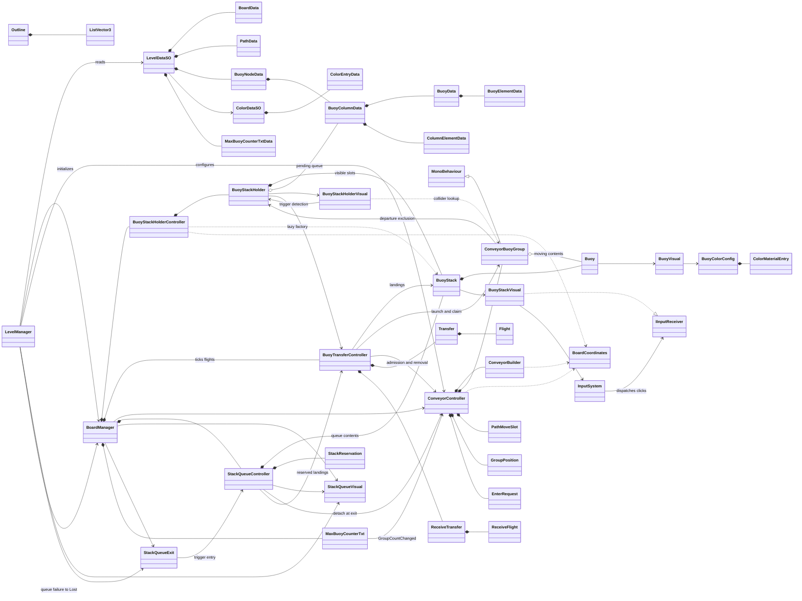
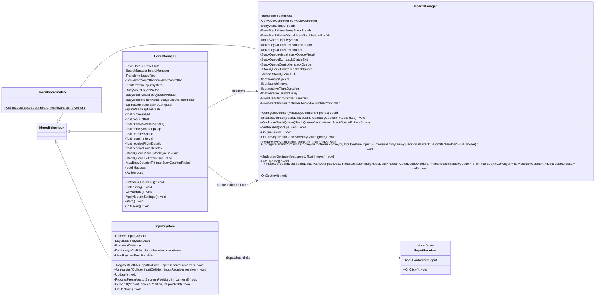
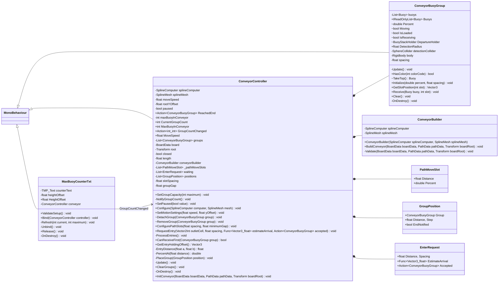
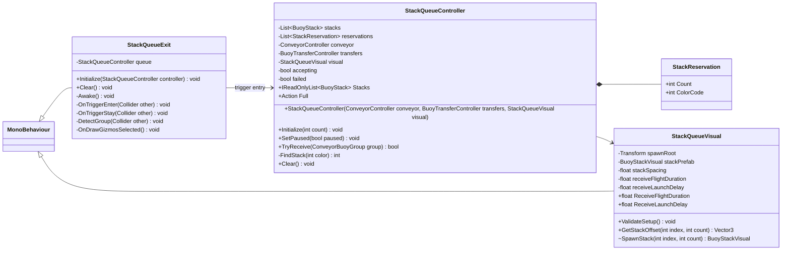
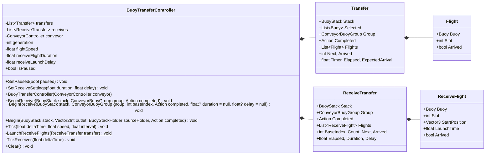
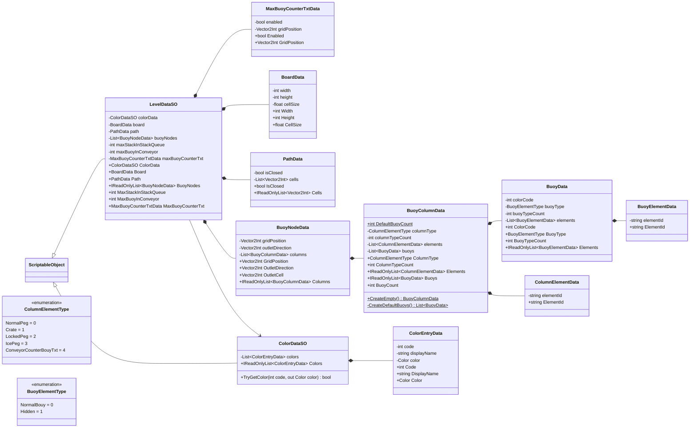
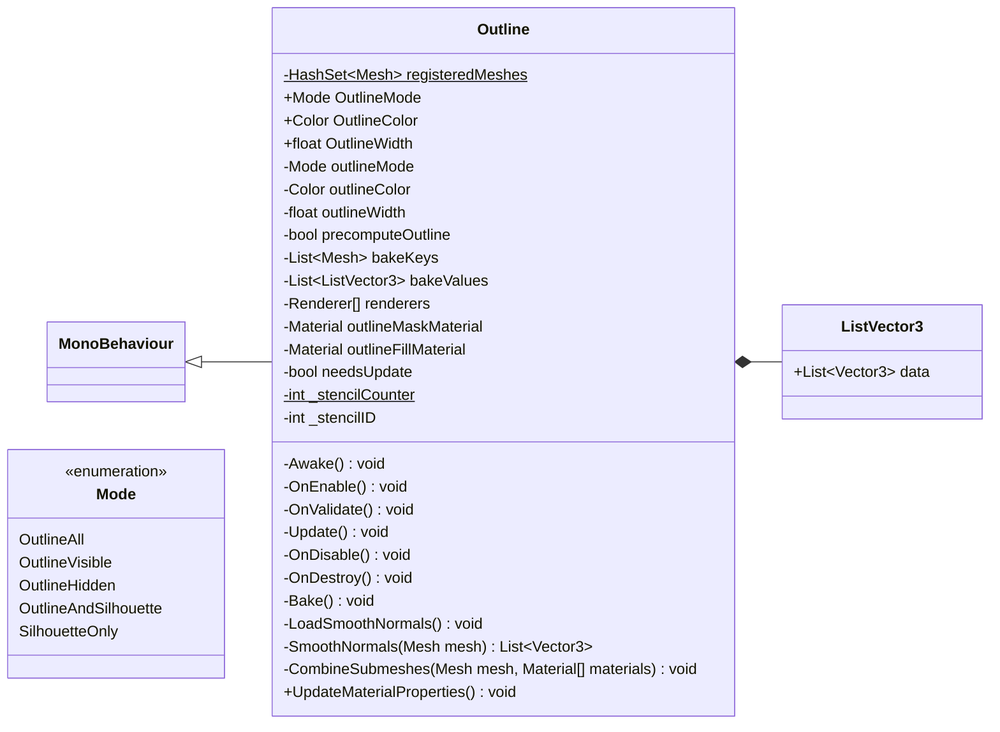

# Class diagram - current implementation

Scope: GameCore, related level data and QuickOutline. Generated from the C# source declarations. Unity and Dreamteck internals are external.

## Legend

`+` public, `-` private, `~` internal, `#` protected, `$` static/const. Properties have no parentheses. Attribute and accessor summaries appear in the C# listings. Multi-argument Mermaid generics use `_`; the C# listings retain exact generic types. Class bodies and method bodies are omitted. Nested types use short names.

## Overview relationships



## Level, board and input



### BoardCoordinates

Source: [Assets/Scripts/GameCore/BoardSystem/BoardCoordinates.cs](../Assets/Scripts/GameCore/BoardSystem/BoardCoordinates.cs).

```csharp
public static Vector3 CellToLocal(BoardData board, Vector2Int cell)
```

### BoardManager

Source: [Assets/Scripts/GameCore/BoardSystem/BoardManager.cs](../Assets/Scripts/GameCore/BoardSystem/BoardManager.cs).

```csharp
[Tooltip("Board center and orientation. Keep its world scale at one for CellSize in world units.")]
private Transform boardRoot;
private ConveyorController conveyorController;
private BuoyVisual buoyPrefab;
private BuoyStackVisual buoyStackPrefab;
private BuoyStackHolderVisual buoyStackHolderPrefab;
private InputSystem inputSystem;
private MaxBuoyCounterTxt counterPrefab;
private MaxBuoyCounterTxt counter;
public void ConfigureCounter(MaxBuoyCounterTxt prefab)
private void InitializeCounter(BoardData board, MaxBuoyCounterTxtData data)
private StackQueueVisual stackQueueVisual;
private StackQueueExit stackQueueExit;
private StackQueueController stackQueue;
public StackQueueController StackQueue => stackQueue;
public event Action StackQueueFull;
public void ConfigureStackQueue(StackQueueVisual visual, StackQueueExit exit)
public void SetPaused(bool paused)
private void OnQueueFull()
private void OnConveyorEnd(ConveyorBuoyGroup group)
private float transferSpeed = 4f;
private float launchInterval = 0.12f;
private float receiveFlightDuration = 0.4f;
private float receiveLaunchDelay = 0.12f;
public void SetReceiveSettings(float duration, float delay)
public void Configure(Transform root, ConveyorController conveyor, InputSystem input, BuoyVisual buoy, BuoyStackVisual stack, BuoyStackHolderVisual holder)
public void SetMotionSettings(float speed, float interval)
private BuoyTransferController transfers;
private void LateUpdate()
private readonly BuoyStackHolderController buoyStackHolderController = new BuoyStackHolderController();
public void InitBoard(BoardData boardData, PathData pathData, IReadOnlyList<BuoyNodeData> nodes, ColorDataSO colors, int maxStackInStackQueue = 3, int maxBuoyInConveyor = 5, MaxBuoyCounterTxtData counterData = null)
private void OnDestroy()
```

### IInputReceiver

Source: [Assets/Scripts/GameCore/InputSystem/IInputReceiver.cs](../Assets/Scripts/GameCore/InputSystem/IInputReceiver.cs).

```csharp
bool CanReceiveInput { get; }
void OnClick();
```

### InputSystem

Source: [Assets/Scripts/GameCore/InputSystem/InputSystem.cs](../Assets/Scripts/GameCore/InputSystem/InputSystem.cs).

```csharp
[SerializeField]
private Camera inputCamera;
[SerializeField]
private LayerMask raycastMask = Physics.DefaultRaycastLayers;
[SerializeField, Min(0.01f)]
private float maxDistance = 1000f;
private readonly Dictionary<Collider, IInputReceiver> receivers = new Dictionary<Collider, IInputReceiver>();
private readonly List<RaycastResult> uiHits = new List<RaycastResult>();
public void Register(Collider inputCollider, IInputReceiver receiver)
public void Unregister(Collider inputCollider, IInputReceiver receiver)
private void Update()
private void ProcessPress(Vector2 screenPosition, int pointerId)
private bool IsOverUI(Vector2 screenPosition, int pointerId)
private void OnDestroy()
```

### LevelManager

Source: [Assets/Scripts/GameCore/LevelSystem/LevelManager.cs](../Assets/Scripts/GameCore/LevelSystem/LevelManager.cs).

```csharp
[SerializeField]
private LevelDataSO levelData;
[SerializeField]
private BoardManager boardManager;
[Header("Board Setup")] [SerializeField]
private Transform boardRoot;
[SerializeField]
private ConveyorController conveyorController;
[SerializeField]
private InputSystem inputSystem;
[SerializeField]
private BuoyVisual buoyPrefab;
[SerializeField]
private BuoyStackVisual buoyStackPrefab;
[SerializeField]
private BuoyStackHolderVisual buoyStackHolderPrefab;
[Header("Conveyor Setup")] [SerializeField]
private SplineComputer splineComputer;
[SerializeField]
private SplineMesh splineMesh;
[SerializeField, Min(0f)]
private float moveSpeed = 1f;
[Tooltip("Group root height above the spline, along the board's local up axis, in world units.")] [SerializeField]
private float rootYOffset = 0.2f;
[SerializeField, Min(0.01f)]
private float pathMoveSlotSpacing = 0.3f;
[SerializeField, Min(0.01f)]
private float conveyorGroupGap = 0.6f;
[Header("Transfer Setup")] [SerializeField, Min(0.01f)]
private float transferSpeed = 4f;
[SerializeField, Min(0f)]
private float launchInterval = 0.12f;
[Header("Conveyor To Stack")] [SerializeField, Min(0.01f)]
private float receiveFlightDuration = 0.4f;
[SerializeField, Min(0f)]
private float receiveLaunchDelay = 0.12f;
[Header("Stack Queue")] [SerializeField]
private StackQueueVisual stackQueueVisual;
[SerializeField]
private StackQueueExit stackQueueExit;
[Header("Conveyor Counter")] [SerializeField]
private MaxBuoyCounterTxt maxBuoyCounterPrefab;
public bool HasLost { get; set; }
public event Action Lost;
private void OnStackQueueFull()
private void OnDestroy()
private void OnValidate()
private void ApplyMotionSettings()
private void Start()
public void InitLevel()
```

## Buoys, stacks and holders

```mermaid
classDiagram
direction LR
class Buoy {
    -BuoyVisual visual
    +int ColorCode
    +BuoyElementType Type
    +int TypeCount
    +IReadOnlyList~string~ Elements
    ~BuoyVisual Visual
    -bool cleared
    +Buoy(BuoyData source, ColorDataSO colors, BuoyVisual visual)
    +Clear() void
}
class BuoyColorConfig {
    -List~ColorMaterialEntry~ colors
    -Dictionary~int_Material~ materials
    +GetMaterial(int colorId) Material
    -OnEnable() void
    -OnValidate() void
    -BuildLookup() void
}
ScriptableObject <|-- BuoyColorConfig
class ColorMaterialEntry {
    -int colorId
    -Material material
    +int ColorId
    +Material Material
}
class BuoyStack {
    -BuoyStackVisual visual
    -List~Buoy~ buoys
    -bool cleared
    ~BuoyStackVisual Visual
    -bool canReceiveInput
    +bool CanReceiveInput
    +GetTopGroup() List~Buoy~
    ~RemoveTop(Buoy buoy) void
    +Action~BuoyStack~ Clicked
    +IReadOnlyList~Buoy~ Buoys
    +ColumnElementType Type
    +int TypeCount
    +IReadOnlyList~string~ Elements
    +BuoyStack(BuoyColumnData source, BuoyStackVisual visual)
    ~AddBuoy(Buoy buoy) void
    +OnClick() void
    +Clear() void
}
class BuoyStackHolder {
    -BuoyStackHolderVisual visual
    -List~BuoyStack~ stacks
    -Queue~BuoyColumnData~ pending
    -Func~BuoyColumnData_BuoyStack~ createStack
    -BuoyTransferController transfer
    -bool busy
    -bool cleared
    +IReadOnlyList~BuoyStack~ Stacks
    +BuoyStack ActiveStack
    +int VisibleCapacity
    +Vector2Int GridPosition
    +Vector2Int OutletDirection
    +Vector2Int OutletCell
    +BuoyStackHolder(BuoyNodeData source, BuoyStackHolderVisual visual)
    ~InitializeStacks(Func~BuoyColumnData_BuoyStack~ factory) void
    -FillVisibleStacks() void
    ~ContainsGroup(ConveyorBuoyGroup group) bool
    ~CanReceive(ConveyorBuoyGroup group) bool
    ~TryReceive(ConveyorBuoyGroup group) bool
    +InitializeTransfers(BuoyTransferController controller) void
    -OnStackClicked(BuoyStack stack) void
    -FinishTransfer() void
    -FinishQueueAdvance() void
    -RefreshInput() void
    +Clear() void
}
class BuoyStackHolderController {
    -List~BuoyStackHolder~ holders
    +IReadOnlyList~BuoyStackHolder~ Holders
    +BuoyStackHolderController()
    +InitHolders(BoardData board, IReadOnlyList~BuoyNodeData~ nodes, ColorDataSO colors, Transform boardRoot, BuoyStackHolderVisual holderPrefab, BuoyStackVisual stackPrefab, BuoyVisual buoyPrefab, InputSystem inputSystem) void
    -CreateStack(Transform parent, BuoyColumnData source, int index, ColorDataSO colors, BuoyStackVisual stackPrefab, BuoyVisual buoyPrefab, InputSystem inputSystem) BuoyStack$
    +Clear() void
}
class BuoyStackHolderVisual {
    -GameObject singleStackVisual
    -GameObject multipleStackVisual
    -Transform stackRoot
    -Vector3 firstStackOffset
    -Vector3 stackStep
    +SetOutletDirection(Vector2Int direction) void
    -Collider receiveCollider
    -float advanceDuration
    -BuoyStackHolder owner
    -Coroutine advanceTween
    +Initialize(BuoyStackHolder holder, int visibleCapacity) void
    ~ContainsGroup(ConveyorBuoyGroup group) bool
    -OnTriggerEnter(Collider other) void
    -OnTriggerStay(Collider other) void
    -DetectGroup(Collider other) void
    +TweenToFront(Transform stack, Action completed) void
    -AdvanceStack(Transform stack, Action completed) IEnumerator
    +PlaceStack(Transform stack, int index) void
    -bool released
    +Release() void
}
MonoBehaviour <|-- BuoyStackHolderVisual
class BuoyStackVisual {
    -Transform buoyRoot
    -Vector3 firstBuoyOffset
    -float buoySpacing
    -float buoyHeight
    -float emptyStackHeight
    -Transform poleTransform
    +float Step
    -Vector3 poleScale, polePosition
    -Bounds poleBounds
    -bool poleCached
    -bool inputEnabled
    -int count
    +SetInputEnabled(bool enabled) void
    +RefreshHeight(int buoyCount) void
    -Collider[] inputColliders
    -InputSystem inputSystem
    -BuoyStack owner
    +bool CanReceiveInput
    +BindInput(BuoyStack stack, InputSystem system) void
    +OnClick() void
    -OnEnable() void
    -OnDisable() void
    -OnValidate() void
    -RegisterInput() void
    -UnregisterInput() void
    +GetBuoyPosition(int index) Vector3
    +PlaceBuoy(Transform buoy, int index) void
    -bool released
    +Release() void
}
MonoBehaviour <|-- BuoyStackVisual
IInputReceiver <|.. BuoyStackVisual
class BuoyVisual {
    -Renderer[] colorRenderers
    -BuoyColorConfig colorConfig
    -MaterialPropertyBlock propertyBlock
    -int BaseColor$
    +Refresh(int colorId, Color color) void
    +MoveTowards(Vector3 target, float distance) bool
    -bool released
    +Release() void
}
MonoBehaviour <|-- BuoyVisual
BuoyStackHolderController *-- BuoyStackHolder
BuoyStackHolderController ..> BuoyStack : lazy factory
BuoyStackHolder *-- BuoyStack : visible slots
BuoyStackHolder --> BuoyStackHolderVisual
BuoyStackHolderVisual --> BuoyStackHolder : trigger detection
BuoyStack *-- Buoy
BuoyStack --> BuoyStackVisual
Buoy --> BuoyVisual
BuoyVisual --> BuoyColorConfig
BuoyColorConfig *-- ColorMaterialEntry
```



### Buoy

Source: [Assets/Scripts/GameCore/BoardSystem/Buoys/Buoy.cs](../Assets/Scripts/GameCore/BoardSystem/Buoys/Buoy.cs).

```csharp
private readonly BuoyVisual visual;
public int ColorCode { get; }
public BuoyElementType Type { get; }
public int TypeCount { get; }
public IReadOnlyList<string> Elements { get; }
internal BuoyVisual Visual => visual;
private bool cleared;
public Buoy(BuoyData source, ColorDataSO colors, BuoyVisual visual)
public void Clear()
```

### BuoyColorConfig

Source: [Assets/Scripts/GameCore/BoardSystem/Buoys/BuoyColorConfig.cs](../Assets/Scripts/GameCore/BoardSystem/Buoys/BuoyColorConfig.cs).

```csharp
[SerializeField]
private List<ColorMaterialEntry> colors = new List<ColorMaterialEntry>();
private Dictionary<int, Material> materials;
public Material GetMaterial(int colorId)
private void OnEnable()
private void OnValidate()
private void BuildLookup()
```

### ColorMaterialEntry

Source: [Assets/Scripts/GameCore/BoardSystem/Buoys/BuoyColorConfig.cs](../Assets/Scripts/GameCore/BoardSystem/Buoys/BuoyColorConfig.cs).

```csharp
[SerializeField]
private int colorId;
[SerializeField]
private Material material;
public int ColorId => colorId;
public Material Material => material;
```

### BuoyStack

Source: [Assets/Scripts/GameCore/BoardSystem/Buoys/BuoyStack.cs](../Assets/Scripts/GameCore/BoardSystem/Buoys/BuoyStack.cs).

```csharp
private readonly BuoyStackVisual visual;
private readonly List<Buoy> buoys = new List<Buoy>();
private bool cleared;
internal BuoyStackVisual Visual => visual;
private bool canReceiveInput;
public bool CanReceiveInput { get; set; }
public List<Buoy> GetTopGroup()
internal void RemoveTop(Buoy buoy)
public event Action<BuoyStack> Clicked;
public IReadOnlyList<Buoy> Buoys { get; }
public ColumnElementType Type { get; }
public int TypeCount { get; }
public IReadOnlyList<string> Elements { get; }
public BuoyStack(BuoyColumnData source, BuoyStackVisual visual)
internal void AddBuoy(Buoy buoy)
public void OnClick()
public void Clear()
```

### BuoyStackHolder

Source: [Assets/Scripts/GameCore/BoardSystem/Buoys/BuoyStackHolder.cs](../Assets/Scripts/GameCore/BoardSystem/Buoys/BuoyStackHolder.cs).

```csharp
private readonly BuoyStackHolderVisual visual;
private readonly List<BuoyStack> stacks = new List<BuoyStack>();
private readonly Queue<BuoyColumnData> pending = new Queue<BuoyColumnData>();
private Func<BuoyColumnData, BuoyStack> createStack;
private BuoyTransferController transfer;
private bool busy;
private bool cleared;
public IReadOnlyList<BuoyStack> Stacks { get; }
public BuoyStack ActiveStack => stacks.Count > 0 ? stacks[0] : null;
public int VisibleCapacity { get; }
public Vector2Int GridPosition { get; }
public Vector2Int OutletDirection { get; }
public Vector2Int OutletCell => GridPosition + OutletDirection;
public BuoyStackHolder(BuoyNodeData source, BuoyStackHolderVisual visual)
internal void InitializeStacks(Func<BuoyColumnData, BuoyStack> factory)
private void FillVisibleStacks()
internal bool ContainsGroup(ConveyorBuoyGroup group)
internal bool CanReceive(ConveyorBuoyGroup group)
internal bool TryReceive(ConveyorBuoyGroup group)
public void InitializeTransfers(BuoyTransferController controller)
private void OnStackClicked(BuoyStack stack)
private void FinishTransfer()
private void FinishQueueAdvance()
private void RefreshInput()
public void Clear()
```

### BuoyStackHolderController

Source: [Assets/Scripts/GameCore/BoardSystem/Buoys/BuoyStackHolderController.cs](../Assets/Scripts/GameCore/BoardSystem/Buoys/BuoyStackHolderController.cs).

```csharp
private readonly List<BuoyStackHolder> holders = new List<BuoyStackHolder>();
public IReadOnlyList<BuoyStackHolder> Holders { get; }
public BuoyStackHolderController()
public void InitHolders(BoardData board, IReadOnlyList<BuoyNodeData> nodes, ColorDataSO colors, Transform boardRoot, BuoyStackHolderVisual holderPrefab, BuoyStackVisual stackPrefab, BuoyVisual buoyPrefab, InputSystem inputSystem)
private static BuoyStack CreateStack(Transform parent, BuoyColumnData source, int index, ColorDataSO colors, BuoyStackVisual stackPrefab, BuoyVisual buoyPrefab, InputSystem inputSystem)
public void Clear()
```

### BuoyStackHolderVisual

Source: [Assets/Scripts/GameCore/BoardSystem/Buoys/BuoyStackHolderVisual.cs](../Assets/Scripts/GameCore/BoardSystem/Buoys/BuoyStackHolderVisual.cs).

```csharp
[Tooltip("Optional decorative objects, separate from the stack root.")] [SerializeField]
private GameObject singleStackVisual;
[SerializeField]
private GameObject multipleStackVisual;
[SerializeField]
private Transform stackRoot;
[SerializeField]
private Vector3 firstStackOffset;
[SerializeField]
private Vector3 stackStep = new Vector3(0f, 0f, -0.8f);
public void SetOutletDirection(Vector2Int direction)
[SerializeField]
private Collider receiveCollider;
[SerializeField, Min(0f)]
private float advanceDuration = 0.3f;
private BuoyStackHolder owner;
private Coroutine advanceTween;
public void Initialize(BuoyStackHolder holder, int visibleCapacity)
internal bool ContainsGroup(ConveyorBuoyGroup group)
private void OnTriggerEnter(Collider other)
private void OnTriggerStay(Collider other)
private void DetectGroup(Collider other)
public void TweenToFront(Transform stack, Action completed)
private IEnumerator AdvanceStack(Transform stack, Action completed)
public void PlaceStack(Transform stack, int index)
private bool released;
public void Release()
```

### BuoyStackVisual

Source: [Assets/Scripts/GameCore/BoardSystem/Buoys/BuoyStackVisual.cs](../Assets/Scripts/GameCore/BoardSystem/Buoys/BuoyStackVisual.cs).

```csharp
[SerializeField]
private Transform buoyRoot;
[SerializeField]
private Vector3 firstBuoyOffset = new Vector3(0f, 0.2f, 0f);
[SerializeField, Min(0f)]
private float buoySpacing = 0f;
[SerializeField, Min(0.01f)]
private float buoyHeight = 0.2f;
[Tooltip("Pole height in stack-local units when there are no buoys. Zero hides the empty pole.")] [SerializeField, Min(0f)]
private float emptyStackHeight = 0.2f;
[SerializeField]
private Transform poleTransform;
public float Step => buoyHeight + buoySpacing;
private Vector3 poleScale, polePosition;
private Bounds poleBounds;
private bool poleCached;
private bool inputEnabled;
private int count;
public void SetInputEnabled(bool enabled)
public void RefreshHeight(int buoyCount)
[SerializeField]
private Collider[] inputColliders;
private InputSystem inputSystem;
private BuoyStack owner;
public bool CanReceiveInput => !released && isActiveAndEnabled && owner != null && owner.CanReceiveInput;
public void BindInput(BuoyStack stack, InputSystem system)
public void OnClick()
private void OnEnable()
private void OnDisable()
private void OnValidate()
private void RegisterInput()
private void UnregisterInput()
public Vector3 GetBuoyPosition(int index)
public void PlaceBuoy(Transform buoy, int index)
private bool released;
public void Release()
```

### BuoyVisual

Source: [Assets/Scripts/GameCore/BoardSystem/Buoys/BuoyVisual.cs](../Assets/Scripts/GameCore/BoardSystem/Buoys/BuoyVisual.cs).

```csharp
[Tooltip("Only renderers which should receive the buoy color.")] [SerializeField]
private Renderer[] colorRenderers;
[SerializeField]
private BuoyColorConfig colorConfig;
private MaterialPropertyBlock propertyBlock;
private static readonly int BaseColor = Shader.PropertyToID("_Color");
public void Refresh(int colorId, Color color)
public bool MoveTowards(Vector3 target, float distance)
private bool released;
public void Release()
```

## Conveyor



### ConveyorBuilder

Source: [Assets/Scripts/GameCore/BoardSystem/Conveyor/ConveyorBuilder.cs](../Assets/Scripts/GameCore/BoardSystem/Conveyor/ConveyorBuilder.cs).

```csharp
private readonly SplineComputer splineComputer;
private readonly SplineMesh splineMesh;
public ConveyorBuilder(SplineComputer splineComputer, SplineMesh splineMesh)
public void BuildConveyor(BoardData boardData, PathData pathData, Transform boardRoot)
private void Validate(BoardData boardData, PathData pathData, Transform boardRoot)
```

### ConveyorBuoyGroup

Source: [Assets/Scripts/GameCore/BoardSystem/Conveyor/ConveyorBuoyGroup.cs](../Assets/Scripts/GameCore/BoardSystem/Conveyor/ConveyorBuoyGroup.cs).

```csharp
private readonly List<Buoy> buoys = new List<Buoy>();
public IReadOnlyList<Buoy> Buoys => buoys;
internal double Percent;
internal bool Moving;
internal bool IsLoaded { get; set; }
internal bool IsReceiving { get; set; }
internal BuoyStackHolder DepartureHolder { get; set; }
public float DetectionRadius => detectionCollider != null ? detectionCollider.radius * Mathf.Max(Mathf.Abs(transform.lossyScale.x), Mathf.Abs(transform.lossyScale.y), Mathf.Abs(transform.lossyScale.z)) : 0f;
private SphereCollider detectionCollider;
private Rigidbody body;
private void Update()
public bool HasColor(int colorCode)
internal Buoy TakeTop()
private float spacing;
public void Initialize(double percent, float spacing)
public Vector3 GetSlotPosition(int slot)
public void Receive(Buoy buoy, int slot)
public void Clear()
private void OnDestroy()
```

### ConveyorController

Source: [Assets/Scripts/GameCore/BoardSystem/Conveyor/ConveyorController.cs](../Assets/Scripts/GameCore/BoardSystem/Conveyor/ConveyorController.cs).

```csharp
private SplineComputer splineComputer;
private SplineMesh splineMesh;
private float moveSpeed = 1f;
private float rootYOffset = 0.2f;
private bool paused;
public event Action<ConveyorBuoyGroup> ReachedEnd;
private int maxBuoyInConveyor = 5;
public int CurrentGroupCount => positions.Count;
public int MaxBuoyInConveyor => maxBuoyInConveyor;
public event Action<int, int> GroupCountChanged;
public void SetGroupCapacity(int maximum)
private void NotifyGroupCount()
public void SetPaused(bool value)
public void Configure(SplineComputer computer, SplineMesh mesh)
public void SetMotionSettings(float speed, float yOffset)
public float MoveSpeed => Mathf.Max(0f, moveSpeed);
private readonly List<ConveyorBuoyGroup> groups = new List<ConveyorBuoyGroup>();
private BoardData board;
private Transform root;
private bool closed;
private float length;
private ConveyorBuilder conveyorBuilder;
private readonly List<PathMoveSlot> _pathMoveSlots = new List<PathMoveSlot>();
private readonly List<EnterRequest> waiting = new List<EnterRequest>();
private readonly List<GroupPosition> positions = new List<GroupPosition>();
private float slotSpacing = 0.3f;
private float groupGap = 0.6f;
internal void DetachGroup(ConveyorBuoyGroup group)
internal void RemoveGroup(ConveyorBuoyGroup group)
public void ConfigurePathSlots(float spacing, float minimumGap)
public void RequestEntry(Vector2Int outletCell, float spacing, Func<Vector3, float> estimateArrival, Action<ConveyorBuoyGroup> accepted)
private void ProcessEntries()
public bool CanReceiveFirst(ConveyorBuoyGroup group)
public Vector3 GetEntryHoldingOffset()
private float EntryDistance(float a, float b)
private double PercentAt(float distance)
private void PlaceGroup(GroupPosition position)
private void Update()
public void ClearGroups()
private void OnDestroy()
public void InitConveyor(BoardData boardData, PathData pathData, Transform boardRoot)
```

### PathMoveSlot

Source: [Assets/Scripts/GameCore/BoardSystem/Conveyor/ConveyorController.cs](../Assets/Scripts/GameCore/BoardSystem/Conveyor/ConveyorController.cs).

```csharp
public float Distance;
public double Percent;
```

### GroupPosition

Source: [Assets/Scripts/GameCore/BoardSystem/Conveyor/ConveyorController.cs](../Assets/Scripts/GameCore/BoardSystem/Conveyor/ConveyorController.cs).

```csharp
public ConveyorBuoyGroup Group;
public float Distance, Step;
public bool EndNotified;
```

### EnterRequest

Source: [Assets/Scripts/GameCore/BoardSystem/Conveyor/ConveyorController.cs](../Assets/Scripts/GameCore/BoardSystem/Conveyor/ConveyorController.cs).

```csharp
public float Distance, Spacing;
public Func<Vector3, float> EstimateArrival;
public Action<ConveyorBuoyGroup> Accepted;
```

### MaxBuoyCounterTxt

Source: [Assets/Scripts/GameCore/BoardSystem/Conveyor/MaxBuoyCounterTxt.cs](../Assets/Scripts/GameCore/BoardSystem/Conveyor/MaxBuoyCounterTxt.cs).

```csharp
[SerializeField]
private TMP_Text counterText;
[SerializeField]
private float heightOffset = 0.8f;
public float HeightOffset => heightOffset;
private ConveyorController conveyor;
public void ValidateSetup()
public void Bind(ConveyorController controller)
private void Refresh(int current, int maximum)
private void Unbind()
public void Release()
private void OnDestroy()
```

## Stack queue and exit



### StackQueueController

Source: [Assets/Scripts/GameCore/BoardSystem/StackQueue/StackQueueController.cs](../Assets/Scripts/GameCore/BoardSystem/StackQueue/StackQueueController.cs).

```csharp
private readonly List<BuoyStack> stacks = new List<BuoyStack>();
private readonly List<StackReservation> reservations = new List<StackReservation>();
private readonly ConveyorController conveyor;
private readonly BuoyTransferController transfers;
private readonly StackQueueVisual visual;
private bool accepting;
private bool failed;
public IReadOnlyList<BuoyStack> Stacks { get; }
public event Action Full;
public StackQueueController(ConveyorController conveyor, BuoyTransferController transfers, StackQueueVisual visual)
public void Initialize(int count)
public void SetPaused(bool paused)
public bool TryReceive(ConveyorBuoyGroup group)
private int FindStack(int color)
public void Clear()
```

### StackReservation

Source: [Assets/Scripts/GameCore/BoardSystem/StackQueue/StackQueueController.cs](../Assets/Scripts/GameCore/BoardSystem/StackQueue/StackQueueController.cs).

```csharp
public int Count;
public int ColorCode;
```

### StackQueueExit

Source: [Assets/Scripts/GameCore/BoardSystem/StackQueue/StackQueueExit.cs](../Assets/Scripts/GameCore/BoardSystem/StackQueue/StackQueueExit.cs).

```csharp
private StackQueueController queue;
public void Initialize(StackQueueController controller)
public void Clear()
private void Awake()
private void OnTriggerEnter(Collider other)
private void OnTriggerStay(Collider other)
private void DetectGroup(Collider other)
private void OnDrawGizmosSelected()
```

### StackQueueVisual

Source: [Assets/Scripts/GameCore/BoardSystem/StackQueue/StackQueueVisual.cs](../Assets/Scripts/GameCore/BoardSystem/StackQueue/StackQueueVisual.cs).

```csharp
[Tooltip("Separate spawn transform. Its position is the center of the stack row.")] [SerializeField]
private Transform spawnRoot;
[SerializeField]
private BuoyStackVisual stackPrefab;
[SerializeField, Min(0.01f)]
private float stackSpacing = 1.2f;
[SerializeField, Min(0.01f)]
private float receiveFlightDuration = 0.4f;
[SerializeField, Min(0f)]
private float receiveLaunchDelay = 0.12f;
public float ReceiveFlightDuration => Mathf.Max(0.01f, receiveFlightDuration);
public float ReceiveLaunchDelay => Mathf.Max(0f, receiveLaunchDelay);
public void ValidateSetup()
public Vector3 GetStackOffset(int index, int count)
internal BuoyStackVisual SpawnStack(int index, int count)
```

## Transfers



### BuoyTransferController

Source: [Assets/Scripts/GameCore/BoardSystem/Buoys/BuoyTransferController.cs](../Assets/Scripts/GameCore/BoardSystem/Buoys/BuoyTransferController.cs).

```csharp
private readonly List<Transfer> transfers = new List<Transfer>();
private readonly List<ReceiveTransfer> receives = new List<ReceiveTransfer>();
private readonly ConveyorController conveyor;
private int generation;
private float flightSpeed = 4f;
private float receiveFlightDuration = 0.4f;
private float receiveLaunchDelay = 0.12f;
public bool IsPaused { get; set; }
public void SetPaused(bool paused)
public void SetReceiveSettings(float duration, float delay)
public BuoyTransferController(ConveyorController conveyor)
internal void BeginReceive(BuoyStack stack, ConveyorBuoyGroup group, Action completed)
internal void BeginReceive(BuoyStack stack, ConveyorBuoyGroup group, int baseIndex, Action completed, float? duration = null, float? delay = null)
public void Begin(BuoyStack stack, Vector2Int outlet, BuoyStackHolder sourceHolder, Action completed)
public void Tick(float deltaTime, float speed, float interval)
private static void LaunchReceiveFlights(ReceiveTransfer transfer)
private void TickReceives(float deltaTime)
public void Clear()
```

### Transfer

Source: [Assets/Scripts/GameCore/BoardSystem/Buoys/BuoyTransferController.cs](../Assets/Scripts/GameCore/BoardSystem/Buoys/BuoyTransferController.cs).

```csharp
public BuoyStack Stack;
public List<Buoy> Selected;
public ConveyorBuoyGroup Group;
public Action Completed;
public readonly List<Flight> Flights = new List<Flight>();
public int Next, Arrived;
public float Timer, Elapsed, ExpectedArrival;
```

### ReceiveTransfer

Source: [Assets/Scripts/GameCore/BoardSystem/Buoys/BuoyTransferController.cs](../Assets/Scripts/GameCore/BoardSystem/Buoys/BuoyTransferController.cs).

```csharp
public BuoyStack Stack;
public ConveyorBuoyGroup Group;
public Action Completed;
public readonly List<ReceiveFlight> Flights = new List<ReceiveFlight>();
public int BaseIndex, Count, Next, Arrived;
public float Elapsed, Duration, Delay;
```

### ReceiveFlight

Source: [Assets/Scripts/GameCore/BoardSystem/Buoys/BuoyTransferController.cs](../Assets/Scripts/GameCore/BoardSystem/Buoys/BuoyTransferController.cs).

```csharp
public Buoy Buoy;
public int Slot;
public Vector3 StartPosition;
public float LaunchTime;
public bool Arrived;
```

### Flight

Source: [Assets/Scripts/GameCore/BoardSystem/Buoys/BuoyTransferController.cs](../Assets/Scripts/GameCore/BoardSystem/Buoys/BuoyTransferController.cs).

```csharp
public Buoy Buoy;
public int Slot;
public bool Arrived;
```

## Level data and enums



### LevelDataSO

Source: [Assets/Scripts/LevelEditorTools/LevelDataSO.cs](../Assets/Scripts/LevelEditorTools/LevelDataSO.cs).

```csharp
[SerializeField]
private ColorDataSO colorData;
[SerializeField]
private BoardData board = new BoardData();
[SerializeField]
private PathData path = new PathData();
[SerializeField]
private List<BuoyNodeData> buoyNodes = new List<BuoyNodeData>();
[SerializeField, Min(1)]
private int maxStackInStackQueue = 3;
[Tooltip("Maximum number of groups on the conveyor, including loading reservations.")] [SerializeField, Min(1)]
private int maxBuoyInConveyor = 5;
[SerializeField]
private MaxBuoyCounterTxtData maxBuoyCounterTxt = new MaxBuoyCounterTxtData();
public ColorDataSO ColorData => colorData;
public BoardData Board => board;
public PathData Path => path;
public IReadOnlyList<BuoyNodeData> BuoyNodes => buoyNodes;
public int MaxStackInStackQueue => Mathf.Max(1, maxStackInStackQueue);
public int MaxBuoyInConveyor => Mathf.Max(1, maxBuoyInConveyor);
public MaxBuoyCounterTxtData MaxBuoyCounterTxt => maxBuoyCounterTxt;
```

### MaxBuoyCounterTxtData

Source: [Assets/Scripts/LevelEditorTools/LevelDataSO.cs](../Assets/Scripts/LevelEditorTools/LevelDataSO.cs).

```csharp
[SerializeField]
private bool enabled;
[SerializeField]
private Vector2Int gridPosition;
public bool Enabled => enabled;
public Vector2Int GridPosition => gridPosition;
```

### BoardData

Source: [Assets/Scripts/LevelEditorTools/LevelDataSO.cs](../Assets/Scripts/LevelEditorTools/LevelDataSO.cs).

```csharp
[SerializeField, Min(1)]
private int width = 10;
[SerializeField, Min(1)]
private int height = 10;
[SerializeField, Min(0.01f)]
private float cellSize = 1f;
public int Width => width;
public int Height => height;
public float CellSize => cellSize;
```

### PathData

Source: [Assets/Scripts/LevelEditorTools/LevelDataSO.cs](../Assets/Scripts/LevelEditorTools/LevelDataSO.cs).

```csharp
[SerializeField]
private bool isClosed;
[SerializeField]
private List<Vector2Int> cells = new List<Vector2Int>();
public bool IsClosed => isClosed;
public IReadOnlyList<Vector2Int> Cells => cells;
```

### BuoyNodeData

Source: [Assets/Scripts/LevelEditorTools/LevelDataSO.cs](../Assets/Scripts/LevelEditorTools/LevelDataSO.cs).

```csharp
[SerializeField]
private Vector2Int gridPosition;
[SerializeField]
private Vector2Int outletDirection;
[SerializeField]
private List<BuoyColumnData> columns = new List<BuoyColumnData> { get; }
public Vector2Int GridPosition => gridPosition;
public Vector2Int OutletDirection => outletDirection;
public Vector2Int OutletCell => gridPosition + outletDirection;
public IReadOnlyList<BuoyColumnData> Columns => columns;
```

### BuoyColumnData

Source: [Assets/Scripts/LevelEditorTools/LevelDataSO.cs](../Assets/Scripts/LevelEditorTools/LevelDataSO.cs).

```csharp
public const int DefaultBuoyCount = 5;
[SerializeField]
private ColumnElementType columnType = ColumnElementType.NormalPeg;
[SerializeField, Min(0)]
private int columnTypeCount;
[SerializeField]
private List<ColumnElementData> elements = new List<ColumnElementData>();
[SerializeField]
private List<BuoyData> buoys = CreateDefaultBuoys();
public ColumnElementType ColumnType => columnType;
public int ColumnTypeCount => columnTypeCount;
public IReadOnlyList<ColumnElementData> Elements => elements;
public IReadOnlyList<BuoyData> Buoys => buoys;
public int BuoyCount => buoys.Count;
public static BuoyColumnData CreateEmpty()
private static List<BuoyData> CreateDefaultBuoys()
```

### BuoyData

Source: [Assets/Scripts/LevelEditorTools/LevelDataSO.cs](../Assets/Scripts/LevelEditorTools/LevelDataSO.cs).

```csharp
[SerializeField]
private int colorCode;
[SerializeField]
private BuoyElementType buoyType = BuoyElementType.NormalBouy;
[SerializeField, Min(0)]
private int buoyTypeCount;
[SerializeField]
private List<BuoyElementData> elements = new List<BuoyElementData>();
public int ColorCode => colorCode;
public BuoyElementType BuoyType => buoyType;
public int BuoyTypeCount => buoyTypeCount;
public IReadOnlyList<BuoyElementData> Elements => elements;
```

### ColumnElementData

Source: [Assets/Scripts/LevelEditorTools/LevelDataSO.cs](../Assets/Scripts/LevelEditorTools/LevelDataSO.cs).

```csharp
[SerializeField]
private string elementId = string.Empty;
public string ElementId => elementId;
```

### BuoyElementData

Source: [Assets/Scripts/LevelEditorTools/LevelDataSO.cs](../Assets/Scripts/LevelEditorTools/LevelDataSO.cs).

```csharp
[SerializeField]
private string elementId = string.Empty;
public string ElementId => elementId;
```

### ColorDataSO

Source: [Assets/Scripts/LevelEditorTools/ColorDataSO.cs](../Assets/Scripts/LevelEditorTools/ColorDataSO.cs).

```csharp
[SerializeField]
private List<ColorEntryData> colors = new List<ColorEntryData>();
public IReadOnlyList<ColorEntryData> Colors => colors;
public bool TryGetColor(int code, out Color color)
```

### ColorEntryData

Source: [Assets/Scripts/LevelEditorTools/ColorDataSO.cs](../Assets/Scripts/LevelEditorTools/ColorDataSO.cs).

```csharp
[SerializeField]
private int code;
[SerializeField]
private string displayName = "New Color";
[SerializeField]
private Color color = Color.white;
public int Code => code;
public string DisplayName => displayName;
public Color Color => color;
```

### ColumnElementType

Source: [Assets/Scripts/LevelEditorTools/LevelDataEnums.cs](../Assets/Scripts/LevelEditorTools/LevelDataEnums.cs).

```csharp
NormalPeg = 0
Crate = 1
LockedPeg = 2
IcePeg = 3
ConveyorCounterBouyTxt = 4
```

### BuoyElementType

Source: [Assets/Scripts/LevelEditorTools/LevelDataEnums.cs](../Assets/Scripts/LevelEditorTools/LevelDataEnums.cs).

```csharp
NormalBouy = 0
Hidden = 1
```

## QuickOutline



### Outline

Source: [Assets/QuickOutline/Scripts/Outline.cs](../Assets/QuickOutline/Scripts/Outline.cs).

```csharp
private static HashSet<Mesh> registeredMeshes = new HashSet<Mesh>();
public Mode OutlineMode { get; set; }
public Color OutlineColor { get; set; }
public float OutlineWidth { get; set; }
[SerializeField]
private Mode outlineMode;
[SerializeField]
private Color outlineColor = Color.white;
[SerializeField, Range(0f, 10f)]
private float outlineWidth = 2f;
[Header("Optional")] [SerializeField, Tooltip("Precompute enabled: Per-vertex calculations are performed in the editor and serialized with the object. " + "Precompute disabled: Per-vertex calculations are performed at runtime in Awake(). This may cause a pause for large meshes.")]
private bool precomputeOutline;
[SerializeField, HideInInspector]
private List<Mesh> bakeKeys = new List<Mesh>();
[SerializeField, HideInInspector]
private List<ListVector3> bakeValues = new List<ListVector3>();
private Renderer[] renderers;
private Material outlineMaskMaterial;
private Material outlineFillMaterial;
private bool needsUpdate;
private static int _stencilCounter = 1;
private int _stencilID;
void Awake()
void OnEnable()
void OnValidate()
void Update()
void OnDisable()
void OnDestroy()
void Bake()
void LoadSmoothNormals()
List<Vector3> SmoothNormals(Mesh mesh)
void CombineSubmeshes(Mesh mesh, Material[] materials)
public void UpdateMaterialProperties()
```

### Mode

Source: [Assets/QuickOutline/Scripts/Outline.cs](../Assets/QuickOutline/Scripts/Outline.cs).

```csharp
OutlineAll
OutlineVisible
OutlineHidden
OutlineAndSilhouette
SilhouetteOnly
```

### ListVector3

Source: [Assets/QuickOutline/Scripts/Outline.cs](../Assets/QuickOutline/Scripts/Outline.cs).

```csharp
public List<Vector3> data;
```

## Current behavior

- Holder VisibleCapacity and decorations are fixed at initialization. Only visible stacks are spawned; pending columns remain data.
- The empty front stack is disabled after its outgoing transfer completes. The rear stack tweens forward while the replacement appears in the rear slot. Only the front accepts input and groups.
- The holder root trigger detects a group using Enter/Stay. Group detection uses a trigger sphere and kinematic Rigidbody.
- Matching loaded groups are claimed with IsReceiving and continue moving while overlapping flights launch to reserved stack indices. Landings commit in order. Serialized fields on LevelManager (holder receiving) and StackQueueVisual (queue receiving) control flight duration and launch delay; each transfer snapshots its timing settings.
- DepartureHolder prevents immediate return to the source until its trigger volume has been left.
- LevelDataSO.MaxBuoyInConveyor limits active conveyor group reservations. MaxBuoyCounterTxt is a separate placed grid node showing current/max; full capacity queues further entry requests.
- StackQueue initializes LevelDataSO.MaxStackInStackQueue empty stacks, centered on its spawn root along local X. It chooses the first empty or same-color stack without a buoy limit.
- Queue reservations claim colors and landing indices immediately; overlapping same-color transfers commit in global stack order.
- Open conveyors notify ReachedEnd once per loaded group. StackQueueExit provides a configurable trigger for open or closed paths. Accepted queue groups release path occupancy immediately and launch from the exit.
- No eligible queue stack triggers LevelManager.HasLost/Lost once and pauses input, conveyor and transfers. Consume is not implemented.
- Reset cancels queue tweens and clears flying buoys before destroying stacks/groups.

## Web viewing

Open [ClassDiagram-Web.html](ClassDiagram-Web.html). Choose a subsystem diagram to reduce layout cost. Import any `.mmd` file into Mermaid-compatible tools. Regenerate with `python Docs/Tools/GenerateClassDiagram.py`.
